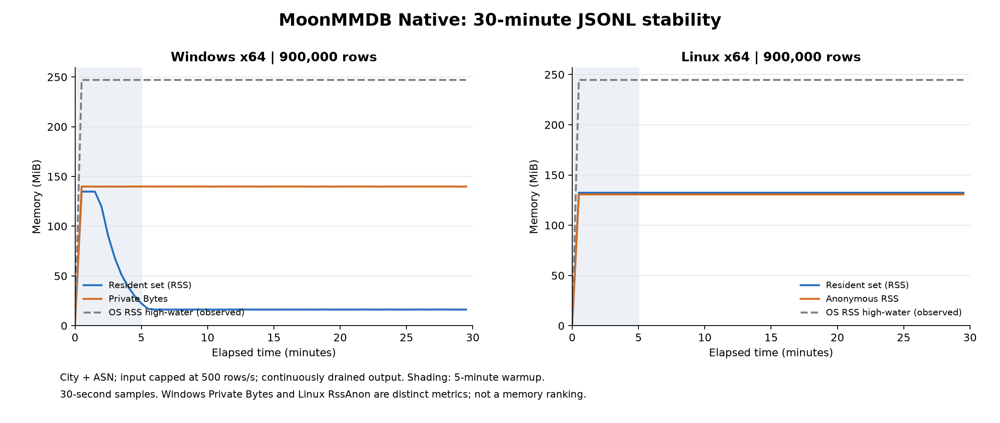

# 0.5.0 验证与发布状态

本版本提供 Windows/Linux x64 Native 查询命令，新增 metadata、lookup、project、enrich-many 产品宿主。现有 Node 命令和核心接口保持兼容。使用、架构和复验入口见 [Native 说明](NATIVE_CLI.md)。

## 已执行的本机验证

- Windows Native 产品命令检查 39 项通过，包括十万行、慢消费者、提前关闭输出、Unicode 路径、四源错误隔离和原始数字保留。
- 固定 City＋ASN 每库 7,114 地址，共 14,228 次与 Python maxminddb 3.2.0 的独立对照通过；各源汇总与 SHA-256 一并核对，数据库合计超限检查通过。
- Native 单元测试 2 项，覆盖 SHA-256 标准向量、百万字节输入、JSON 嵌套上限和数组索引。
- 原有核心 Windows Native debug/release 各 30 项，独立消费模块 1 项、分析模块 4 项通过。
- 原有完整发布回归通过，包括 JS/WasmGC、独立参考、差异与联合查询对照、规模数据库和隔离包消费；历史参考实现分歧保持原记录。
- Windows ZIP 经解压后校验文件散列，并在移除开发工具路径的环境中执行帮助版本、元数据、查询、投影和联合日志补充。静态导入为 KERNEL32、msvcrt；Unicode 参数另加载系统 shell32。

## 输入兼容边界

额外对照检查发现：Native 会拒绝未配对的 Unicode 代理项转义，Node JSON.parse 接受它们；正确的代理项对、普通 Unicode、巨大指数和原始大整数正常处理。Native 沿用固定 MoonBit 解析器的 Unicode 要求，相关行返回 invalid-jsonl，不静默替换字符。另有约定的 128 层嵌套上限。此边界不应被写成所有 JSON 输入完全兼容。

## 持续运行与远端验收

[Native 产品 CI](https://github.com/HhWw96/moonmmdb/actions/runs/35554063542) 与 [完整回归 CI](https://github.com/HhWw96/moonmmdb/actions/runs/35554063512) 均通过。结果绑定实现提交 `4115070136db3a568e63d5a7704b62e73d8fb23d`，后续仅补充文档与发布回执。

| 验证 | Windows Server 2022 x64 | Ubuntu 22.04 x64 |
|---|---:|---:|
| Native 命令及边界检查 | 39 项通过 | 40 项通过，含 FIFO 非阻塞拒绝 |
| 慢消费者流式处理 | 100,000 行 | 100,000 行 |
| City＋ASN 独立参考对照 | 14,228 次 | 14,228 次 |
| 实际 CLI 持续运行 | 1,800.063 秒 / 900,000 行 | 1,800.140 秒 / 900,000 行 |
| 预热后 RSS 中位数增长 | 0 字节 | 0 字节 |
| 句柄或文件描述符趋势 | 通过 | 通过 |
| 解压后移除开发工具 PATH 验收 | 通过 | 通过；同一包另在 Ubuntu 24.04 通过 |

命令检查覆盖 IPv4/IPv6、未命中、缺失字段、损坏源、重复配置、中文/空格/非 BMP 路径、UTF-8/BOM/CRLF、无末行换行、嵌套 IP、原始大整数、长度/行数限制、坏配置不消费 stdin 和输出提前关闭。中断不生成完成汇总。兼容性按 JSON 内容、错误类别及退出码比较，不要求系统错误文案相同。原始报告见 [证据目录](../verification/releases/0.5.0/README.md)。

### 持续运行与内存

两个平台分别运行真实 Native CLI 30 分钟，输入限速 500 行/秒、输出持续消费，各处理 900,000 行。每行结果核对，无崩溃或漂移。每 30 秒采样，预热 5 分钟后比较前后各 10 个样本中位数；增长门槛为 64 MiB 与早期中位数的 25% 中较大者。Windows 工作集/Private Bytes 与 Linux RSS 均通过；句柄/文件描述符未持续增长。限速吞吐约 500 行/秒，不能作为最大吞吐基准。

Windows 观察到的 OS 工作集高水位为 259,031,040 字节，峰值采样工作集 141,352,960 字节、Private Bytes 146,714,624 字节。Linux 观察到的 OS RSS 高水位为 256,507,904 字节，峰值采样 RSS 138,792,960 字节、RssAnon 137,023,488 字节。高水位和间隔采样峰值是不同指标；Windows Private Bytes 与 Linux RssAnon 也不等价。Windows 工作集下降不表示保留的私有内存同步释放。

本机另完成 1,800.046 秒 / 900,000 行，RSS 中位数增长 24,576 字节、Private Bytes 增长 0、句柄保持 58；该早期本机报告只记录间隔采样峰值，不冒充 OS 高水位。图表使用两份最终 CI 报告，可用 `docs/plot_native_soak.py` 复绘。数据库每份与合计 256 MiB 是文件限制，不是进程内存限制。

### 数据与平台绑定

使用固定 DB-IP Lite 2026-09 City 与 ASN，每库 7,114 个确定性地址。Python maxminddb 3.2.0 分别查询每库作为独立参考，再核对 Native 联合结果、汇总与散列；每个平台共 14,228 次通过。来源、许可与下载入口见 [数据清单](../verification/production-sources.json)。生产数据库不随发布包分发。

| 数据库 | 文件字节数 | SHA-256 |
|---|---:|---|
| City | 127,339,927 | `05a10861259c7966cb54d7181ef8c360de8c8829d182098c0e62a9b7d54cd50d` |
| ASN | 9,511,026 | `ab07c764a10c4f8c2f3539377fa86e5c928243084aafd359d1be4cb8543d7406` |

这是指定版本和地址的抽样读取正确性证据，不是定位准确率或全记录认证。

固定 MoonBit `0.10.11+6ff76a5f9`。x@0.5.5 的加密源码子集保留许可证与逐文件来源散列，仅将 AES 中四处旧数组构造语法适配到固定编译器；SHA-256 算法未改动。详见 [第三方清单](../THIRD_PARTY.md) 和 [依赖来源](../native_cli/vendor/x/PROVENANCE.json)。核心库没有新增依赖。

Windows 使用固定 GCC；导入的 KERNEL32、msvcrt 与动态加载的 shell32 均为系统组件。Linux 在 Ubuntu 22.04 构建，声明最低 glibc 2.35，并在 Ubuntu 24.04 验证；只依赖系统 libc/加载器。未声明 MSVC、macOS、ARM64 或 Alpine 支持。Native 尚不提供 enrich、diff、analytics；对应 Node 功能保留。

v0.4.0 默认 Node 配置曾超过 RSS 增长门槛；此限制继续保留。固定堆或显式 GC 的历史复验不能覆盖默认配置失败，也不能用本轮 Native 结果替代 JS 结论。

## 发布

验证门槛已通过，Mooncakes 0.5.0 已上传并完成全新目录安装，JS/WasmGC 均通过精确 ASN 查询及 Enricher 消费测试；没有本地 workspace 替代。注册表下载包与上传包逐字节散列一致。GitHub Release 正在发布，最终状态见 [发布回执](../verification/releases/0.5.0/publication.json)。本次原始 CI 压缩包的 SHA-256：

| 文件 | SHA-256 |
|---|---|
| moonmmdb-0.5.0-windows-x64.zip | `43998e32df43d62114227fd7df8feea813649f1780347c025540241ea8419583` |
| moonmmdb-0.5.0-linux-x64.tar.gz | `61da6cfed11e95f39d191ade49e5fc20dcdbcfe8ed95a241d7f111f90f3a8bbc` |

发布直接使用通过 CI 的原始压缩包，不重新编译或打包。逐文件清单位于各包 MANIFEST.json，附快速入门、人工离线样例、许可证及第三方声明。
